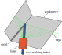
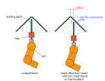

# spARCS-project
### an ARCS course project proposal for situational aware robotics 
.

## 

# proposal
### ideoalogy
small explenation to introduce relevance of (self-)aware production machines

### Task
The welding of a fillet weld(s).
### Perception
* Detection of feature
    * Using a camera mounted on robot arm 1 
    * Detecting the feature to be welded (features defined by CAD model)
    * Determining the location and rough direction of weld
* Local geometry of weld location
    * Distance sensing lidar mounted on top of the welding torche (located on robot arm 2)   
    .
    * Determine the optimal welding position. (Making sure the bead is put in the corner of the weld)

### Environment
* Avoiding collision with:
    * Clamping setup (welding table, clamps, ...)
    * Construction to be welded
    * Other robot arm

### Planning/Control
* Planning:
    * CAD model determines feature to be welded
        * Feature contains weld parameters like length, tortch angle, position of weld in workpiece coordinate system (WCS), ...
    * Determening scanning zone based on scanning strategy:
        * Rough global picture used to plan scanning zone for feature 1
        * Found location of feature 1 could be used to plan scanning zone for subsequent feature 2
    * Planning movement of camara arm to scanning zone and in scanning zone
    * Planning of welding arm trajectory

* Control:
    * Camera arm motion feedback: successive re-evaluation of environment
    * Welding torche feedback: using lidar to keep torche centered in the corner
    .
    * Weld gap control based on welding current
    

## Conclusion
Hopefully we 'spARC(s)' some interest ;) 